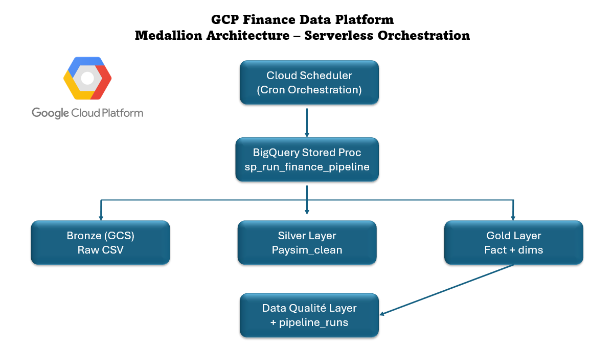
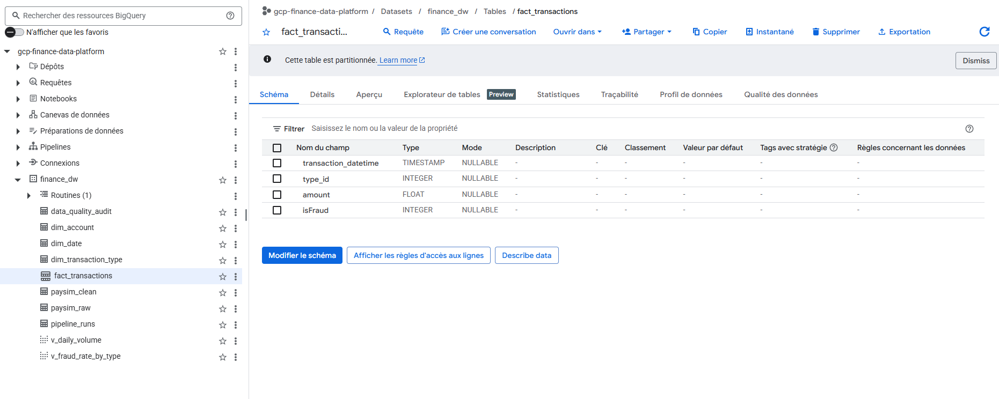

# GCP Finance Data Platform  
### Architecture Medallion Serverless – BigQuery & Cloud Scheduler

---

## 📖 Contexte

Ce projet met en œuvre une Data Platform complète sur Google Cloud Platform (GCP) en utilisant une architecture Medallion (Bronze / Silver / Gold) appliquée à un dataset de transactions financières (PaySim).

L’objectif est de démontrer des pratiques industrielles de Data Engineering :

- Ingestion dans un Data Lake (GCS)
- Modélisation Data Warehouse (BigQuery)
- Implémentation d’un modèle en étoile
- Optimisation via partitionnement et clustering
- Mise en place d’une couche Data Quality
- Journalisation des exécutions (audit logging)
- Orchestration automatisée via Cloud Scheduler
- Pipeline piloté par Stored Procedure

---
 
## 🏗️ Architecture globale



## 🔄 Flux de traitement
```
Cloud Scheduler
        ↓
BigQuery Stored Procedure
        ↓
Bronze (GCS – Raw)
        ↓
Silver (Transformation)
        ↓
Gold (Star Schema)
        ↓
Data Quality & Audit Logging
```
Architecture 100% serverless (pas de cluster permanent).

---

## 🥉 Bronze Layer – Data Lake (GCS)

- Stockage des données brutes dans Google Cloud Storage
- Zone d’ingestion immuable
- Séparation stricte stockage / transformation

Choix technique :
- GCS pour la scalabilité
- Faible coût de stockage

---

## 🥈 Silver Layer – Data Preparation

Transformations effectuées via BigQuery :

- Conversion temporelle (`step → transaction_datetime`)
- Filtrage des anomalies (`amount > 0`)
- Normalisation des types
- Préparation des données métier

Objectif :
Séparer les données techniques des données analytiques.

---

## 🥇 Gold Layer – Data Warehouse

Implémentation d’un modèle en étoile :


### Tables de faits
- `fact_transactions`

### Dimensions
- `dim_transaction_type`
- `dim_date`

Optimisations :

- Partitionnement par date
- Clustering par type_id
- Requêtes analytiques optimisées

---

## 🧪 Data Quality Layer

Contrôles intégrés au pipeline :

- Cohérence du nombre de lignes
- Vérification des valeurs nulles
- Contrôle du taux de fraude
- Validation des volumes

Résultats stockés dans :
- `data_quality_audit`
- `pipeline_runs`

Approche :
- Validation systématique à chaque exécution.
- Log structuré pour audit & traçabilité

---

## ⚙️ Orchestration Serverless

Orchestration via :

- Cloud Scheduler
- Appel HTTP vers l’API BigQuery
- Exécution d’une Stored Procedure unique

Pourquoi ce choix ?

- Pas de cluster GKE
- Pas de maintenance d’Airflow
- Coût réduit
- Architecture simplifiée
- Approche cloud-native

---

## 📊 Monitoring & Audit

Chaque exécution génère :

- run_id unique
- start_time
- end_time
- status (SUCCESS / FAILED)
- message


Permet :

- Traçabilité
- Auditabilité
- Supervision du pipeline

---

## 🛠️ Stack Technique

- Google Cloud Storage
- BigQuery
- Cloud Scheduler
- SQL
- Architecture Medallion
- Modélisation en étoile
- Serverless orchestration

---

## 💡 Décisions d’architecture

| Sujet | Choix | Justification |
|--------|--------|--------------|
| Orchestration | Cloud Scheduler | Plus léger que Composer |
| Transformations | BigQuery SQL | Serverless & scalable |
| Stockage brut | GCS | Séparation stockage/compute |
| Modélisation | Star Schema | Optimisé pour l’analytique |
| Monitoring | Audit table | Observabilité intégrée |

---

## 💰 Optimisation des coûts

- Partitionnement pour limiter les scans
- Clustering pour améliorer les performances
- Orchestration serverless (pas de cluster permanent)
- GCS utilisé uniquement pour stockage brut

Architecture conçue pour minimiser les coûts BigQuery.

---

## 🚀 Améliorations futures

- Gestion avancée des erreurs
- Alerting automatique en cas d’échec
- Infrastructure as Code (Terraform)
- Monitoring via Cloud Monitoring
- Intégration CI/CD

---

## 🎯 Compétences démontrées

- Conception d’architecture Data Platform
- Data Engineering sur GCP
- BigQuery optimization
- SQL avancé
- Modélisation en étoile
- Orchestration serverless
- Data Quality & audit logging
- Design cloud-native scalable
- Data Quality design
- Audit logging
